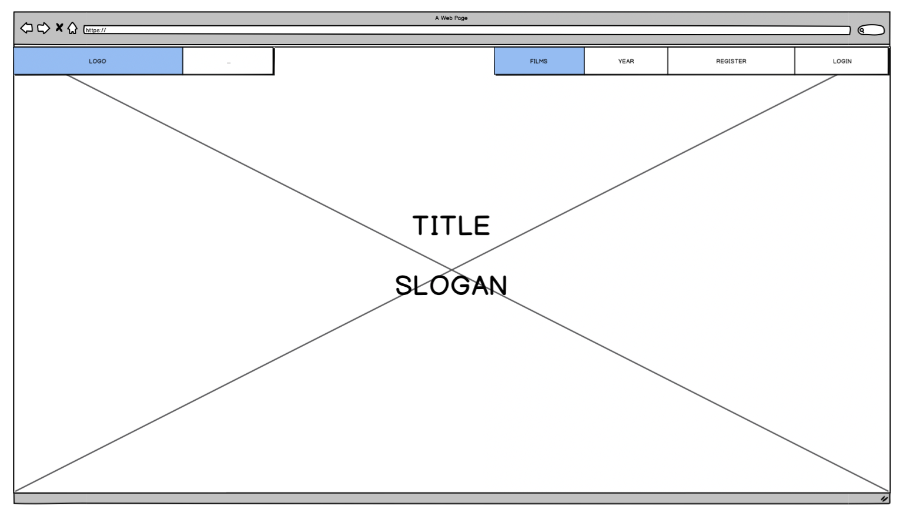
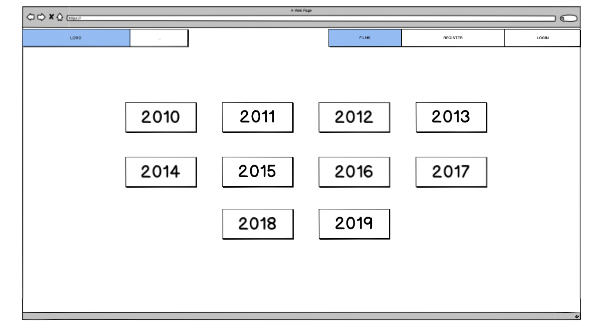
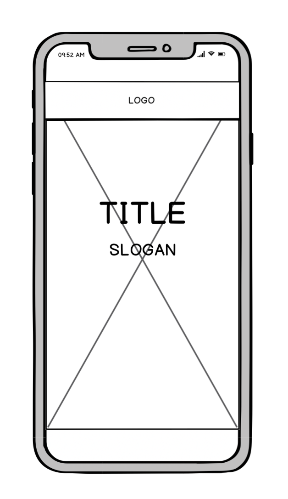
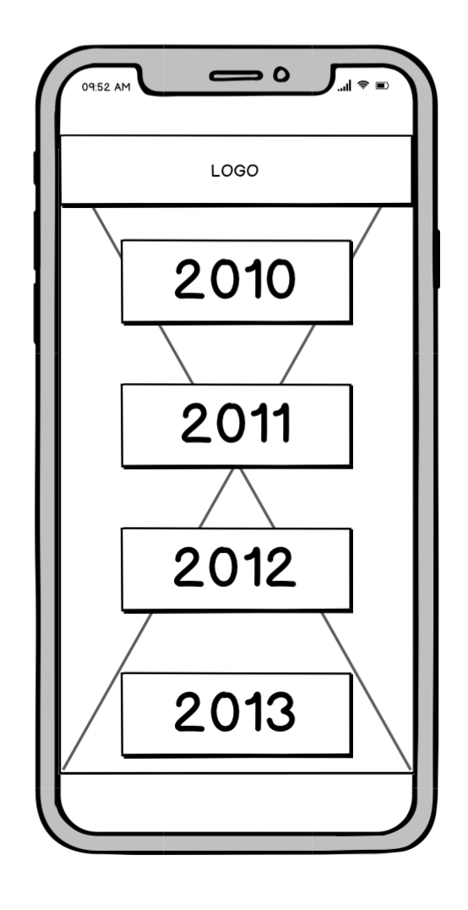
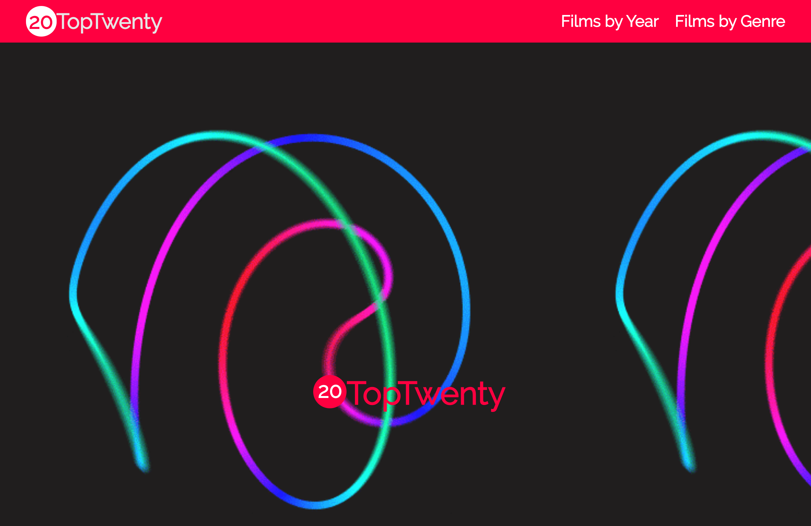
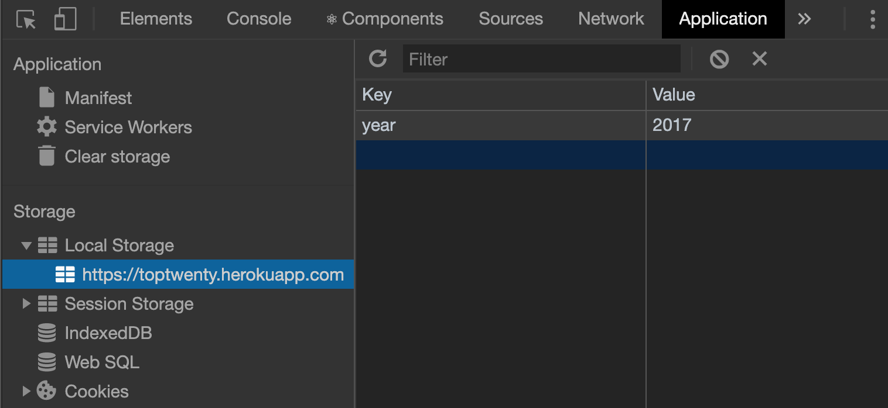
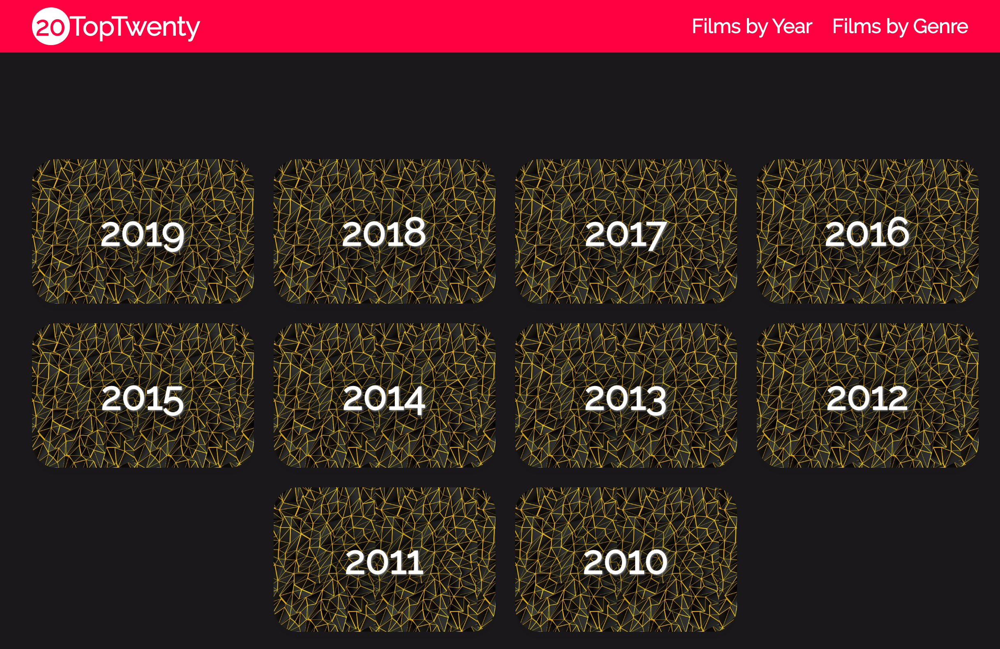
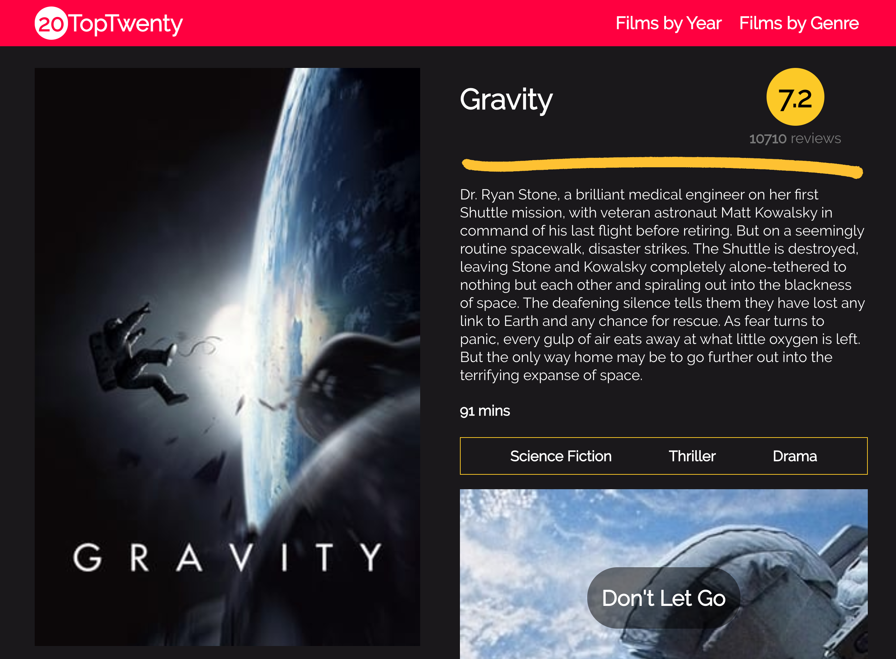

# Software Engineering Immersive: Project 2
This was my second project built whilst studying the Software Engineering Immersive course at General Assembly.

This application was built in only 48 hours during Week 6 of the course, alongside of [Emily Summers](https://github.com/EmilySummers).

# TopTwenty

## Brief
The projects necessary requirements were..
+ **Consume a public API** – this could be anything but it must make sense for your project
+ **Have several components** - At least one classical and one functional
+ **The app should include a router** - with several "pages"
+ **Be deployed online** and accessible to the public

## Tech Stack
This project was built using the following technologies.
+ HTML5
+ CSS3/SCSS
+ Bulma
+ JavaScript
+ React.js
+ The Movie Database API
+ GitHub
+ Balsamiq (for wireframes)

## Release History
1.0 - This game will not be updated so as to stay true to the challenge of building it in 48 hours. This is also to serve as a benchmark for how much I have improved since the date (24/01/20) this was submitted and deployed. Any improvements stated to be made to it will be done so in a follow up project.

## Deployment
The game is deployed utilising Heroku and it can be found here via this link [TopTwenty](https://toptwenty.herokuapp.com/)

## Getting Started
Use the clone button to download the app's source code. Then once you have navigated to the root directory in the terminal type 'npm run server'. The application will then run on `localhost:8000`, which you can then access from your browser of choice (Chrome in most cases 😄).

## Design
We started our project by designing the layout with Balsamiq.

Desktop Wireframes



Mobile Wireframes




To see the other wireframes made for the project you can click [here](https://github.com/latchjack/sei-project-2/tree/master/readmefiles/wireframes "wireframe repo link") to access their folder in the repository.

## Approach
When we started to plan the site we decided we wanted to build a clean site that would be easy to navigate. We wanted to have a landing page, a page to browse through the index and page which would hold more information on each individual item.

```js
const App = () => (
  <BrowserRouter>
    <>
      <Navbar />
      <Switch>
        <Route exact path="/" component={Home} />
        <Route path="/films/:id" component={FilmShow} />
        <Route path="/years" component={FilmYear} />
        <Route path="/genres" component={FilmGenre} />
        <Route path="/films" component={FilmIndex} />
        <Route path="/filmsbygenre" component={FilmGenreIndex} />
      </Switch>
    </>
  </BrowserRouter>
)
```
We were instructed to pair-programme, and to have a *driver* and a *coder* so we took turns to build the project from one computer. 

We decided to work on films as it was a topic we were both passionate about and knew it would help us build a great app. The external API we chose to use was The Movie Database (TMDB - not to be confused with IMDb).

*A screenshot of our homepage*


## Website Architecture

First we worked on retrieving the film data from the API.
We requested the year's data and stored in state, whilst also saving it into the browser's local storage for us to use later on. 

```js
  componentDidMount() {
    const year = localStorage.getItem('year')
    this.setState({ year }, () => {
      this.getFilm()
    })
  }
```

Using the `componentDidMount()` function we were able to make a Get request with axios to the API and pull all of the data into our application and store it in the State.

```js
  async getFilm() {
    try {
      const res = await axios.get(`https://api.themoviedb.org/3/discover/movie?primary_release_year=${this.state.year}&api_key=3afeb04a1fe8f1b2dc3b55f9ed835c6d`)
      this.setState({ films: res.data.results })
    } catch (err) {
      console.log(err)
    }
  }
```

We used the API's url to set a template literal that would allow us to change the year in the url to retrieve the most popular films that year.
Together we wrote a function named `getFilm` that would allow us to grab the year stored in local storage and place it into the template literal in the address. This way when a user clicked on a year it would only grab the twenty films for that specific year.



We then rendered the index of films by mapping over the array stored in State. Using each Film's Id as the key we were able to store all of the film's data in the FilmCard component and render each one them as separate cards on the page. 

```js
  render() {
    return (
      <section className="section">
        <div className="container">
          <div className="columns is-mobile is-multiline">
            {this.state.films.map(film => <FilmCard key={film.id} {...film} />)}
          </div>
        </div>
      </section>
    )
  }
```

We wanted a user to be able to click on any of the films and be taken to another page that contained more details about it. To do this we used the Id of the film to make a request to the API for the selected film.

Below is an example of the data that was returned from the API for an individual film.

```json
{
  "movie_results": [
    {
      "id": 27205,
      "video": false,
      "vote_count": 24297,
      "vote_average": 8.3,
      "title": "Inception",
      "release_date": "2010-07-15",
      "original_language": "en",
      "original_title": "Inception",
      "genre_ids": [
        28,
        12,
        878
      ],
      "backdrop_path": "/s2bT29y0ngXxxu2IA8AOzzXTRhd.jpg",
      "adult": false,
      "overview": "Cobb, a skilled thief who commits corporate espionage by infiltrating the subconscious of his targets is offered a chance to regain his old life as payment for a task considered to be impossible: \"inception\", the implantation of another person's idea into a target's subconscious.",
      "poster_path": "/qmDpIHrmpJINaRKAfWQfftjCdyi.jpg",
      "popularity": 53.854
    }
  ],
  "person_results": [],
  "tv_results": [],
  "tv_episode_results": [],
  "tv_season_results": []
}
```

Using React and Bulma we were able to customise how the data was laid out on the page to make it easy to read and visually appealing.

## Screenshots

Year select page


2019's film page


Gravity's film page


## Challenges and Improvements

### Challenges
The main challenges we had on this project were...
1. The first challenge we had was figuring out how to collect and use the year data from the API. It took us a few attempts before we realised we could set it in State to use the template literal in the url of the Get request and then store it in the browser's local storage.
2. When we wanted to retrieve the genres of the movies we were trying to get the information from the same Get request as the filmId on the Show page

### Improvements
The improvements I would like to make to the project would be...
1. I would love to add a new feature to group films by their age ratings, however the API doesn't seem to have this information stored. I would have to utilise another API that does keep a record of the age ratings.

## Wins & Key Learnings
### Wins
In the planning phase of the project we knew we wanted to create a beautiful website that was easy for users to navigate around. We wanted multiple pages, including an index and many _show_ pages.

We also wanted to find a good API that provided a lot of data and put as much as possible to use. After finding the TMDB API we found that we had a lot of useful information that we could display for the user.

We had also just recently started learning about React.js so I think we did well to show we understood the concepts of state and using external APIs. 

### Key Learnings
The key knowledge I gained from completing this project was...

+ Using React.js.
+ Sass and Bulma.
+ Utilising external API data and API keys.
+ Insomnia.


___

#### Author
Latch Jack - You can contact me via [Twitter](https://twitter.com/LatchCodes "My twitter profile") or via [email](mailto:latch.jack@gmail.com "my email").

Thank you for visiting my repository! :)